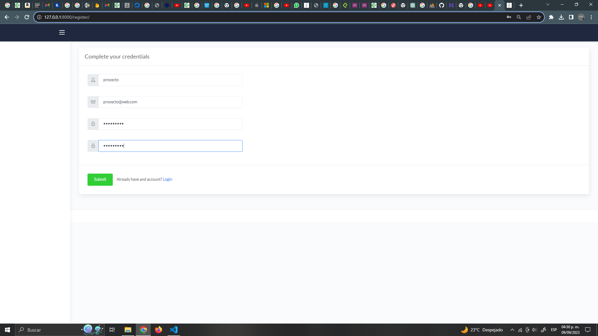
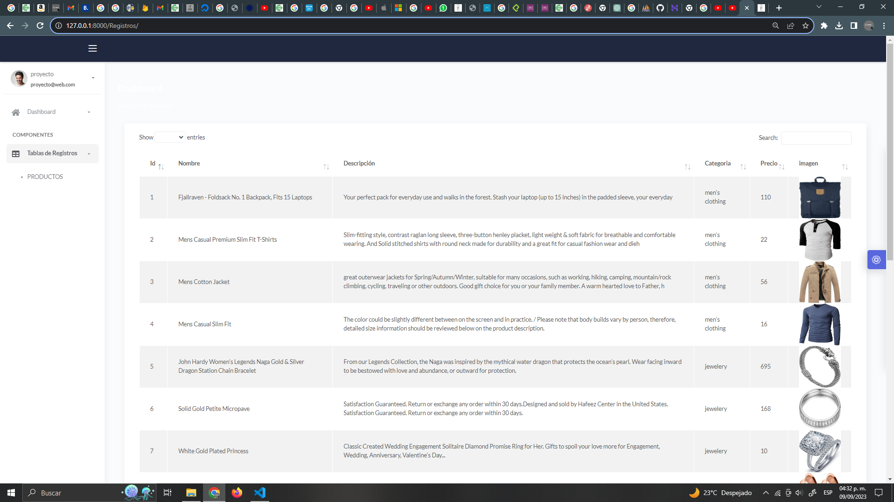
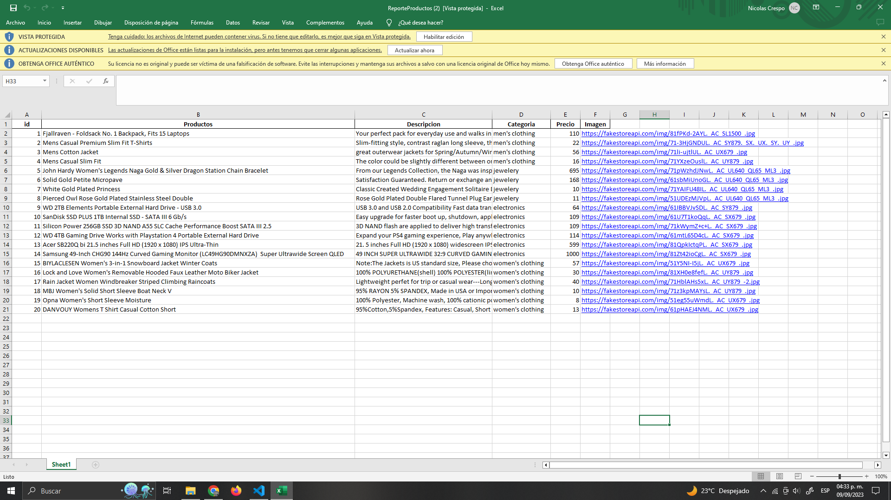
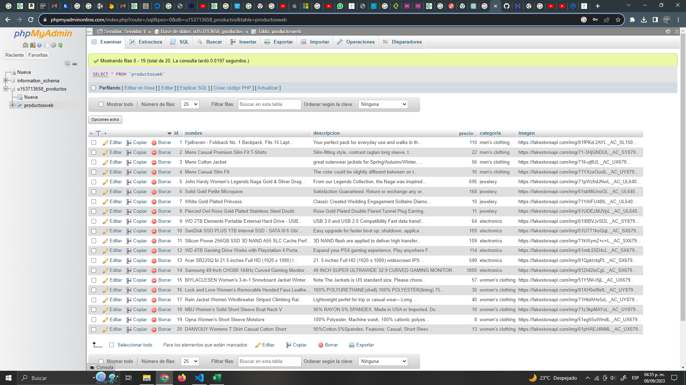
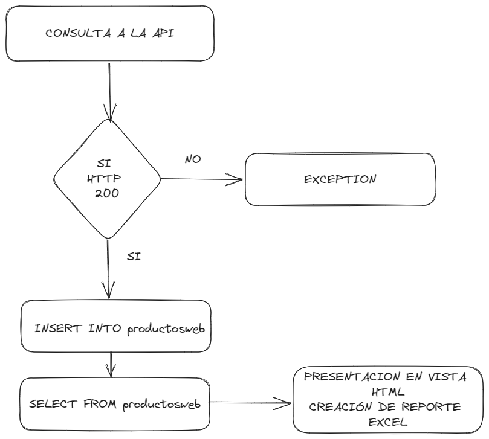

# [Django Dashboard] PROYECTO FINAL

El objetivo de la prueba final es obtener una visión general del tratamiento de datos desde
su obtención hasta su almacenado

<br />

> OBJETIVOS

- Consigue extraer datos de una fuente de datos online.
Por ejemplo:
una API web meteorológica, un portal inmobiliario o de venta de artículos de segunda mano,
extraer texto de pdfs o foros…
- Almacenar esta información de forma estructurada en una base de datos en la nube, puede
ser tipo MongoDB (Mongo Atlas) o una base de datos tipo SQL

- Crear un servicio web (usando Python + Flask o Django) que acceda a esa base de datos y
haga algo (puede ser simplemente un print) o algo más elaborado como un buscador web


<br />

# PROCEDIMIENTO
Se realizo la descarga de una plantilla de Dashboard donde se puede encontrar en los siguientes links:

> Links

- [Django Atlantis Lite](https://appseed.us/admin-dashboards/django-dashboard-atlantis) - Product page
- [Django Atlantis Lite - Demo](https://django-atlantis-lite.appseed-srv1.com/) - LIVE Deployment

LINK DE API DE PRODUCTOS
- [FAKE STORE API](https://fakestoreapi.com/) - Product API


<br />

#DOCUMENTACION DE DJANGO DASHBOARD
## Want more? Go PRO!


<br />

## Como inicializar en VISUAL CODE el proyecto

```bash
$ # Get the code
$ git clone https://github.com/app-generator/django-dashboard-atlantis.git
$ cd django-dashboard-atlantis
$
$ # Virtualenv modules installation (Unix based systems)
$ virtualenv env
$ source env/bin/activate
$
$ # Virtualenv modules installation (Windows based systems)
$ # virtualenv env
$ # .\env\Scripts\activate
$
$ # Install modules - SQLite Storage
$ pip3 install -r requirements.txt
$
$ # Create tables
$ python manage.py makemigrations
$ python manage.py migrate
$
$ # Start the application (development mode)
$ python manage.py runserver # default port 8000
$
$ # Start the app - custom port
$ # python manage.py runserver 0.0.0.0:<your_port>
$
$ # Access the web app in browser: http://127.0.0.1:8000/
```

> Nota: la aplicación se abre con un previo registro sin autenticación dada por la plantilla

<br />

## Estructura del código Base

The project is coded using a simple and intuitive structure presented bellow:

```bash
< PROJECT ROOT >
   |
   |-- core/                               # Implements app logic and serve the static assets
   |    |-- settings.py                    # Django app bootstrapper
   |    |-- wsgi.py                        # Start the app in production
   |    |-- urls.py                        # Define URLs served by all apps/nodes
   |    |
   |    |-- static/
   |    |    |-- <css, JS, images>         # CSS files, Javascripts files
   |    |
   |    |-- templates/                     # Templates used to render pages
   |         |
   |         |-- includes/                 # HTML chunks and components
   |         |    |-- navigation.html      # Top menu component
   |         |    |-- sidebar.html         # Sidebar component
   |         |    |-- footer.html          # App Footer
   |         |    |-- scripts.html         # Scripts common to all pages
   |         |
   |         |-- layouts/                  # Master pages
   |         |    |-- base-fullscreen.html # Used by Authentication pages
   |         |    |-- base.html            # Used by common pages
   |         |
   |         |-- accounts/                 # Authentication pages
   |         |    |-- login.html           # Login page
   |         |    |-- register.html        # Register page
   |         |
   |      index.html                       # The default page
   |     page-404.html                     # Error 404 page
   |     page-500.html                     # Error 404 page
   |       *.html                          # All other HTML pages
   |
   |-- authentication/                     # Handles auth routes (login and register)
   |    |
   |    |-- urls.py                        # Define authentication routes  
   |    |-- views.py                       # Handles login and registration  
   |    |-- forms.py                       # Define auth forms  
   |
   |-- app/                                # A simple app that serve HTML files
   |    |
   |    |-- views.py                       # Serve HTML pages for authenticated users
   |    |-- urls.py                        # Define some super simple routes  
   |
   |-- requirements.txt                    # Development modules - SQLite storage
   |
   |-- .env                                # Inject Configuration via Environment
   |-- manage.py                           # Start the app - Django default start script
   |
   |-- ************************************************************************
```

<br />
#PROCEDIMIENTO DE PROYECTO

Se creó dos carpetas llamadas registros y datos con el codigo: 

```bash
$ python manage.py startapp registros
$ python manage.py startapp datos
```
Estas carpetas contienen lo necesario para llevar acabo la parte logica de python y el uso de la plantilla HTML, una ejecuta una vista y datos crea un reporte en excel.

Codigo de consulta de API en carpeta REGISTROS y guardado de datos en SQL
   	
		
		if request.method == "GET":
			
			url = "https://fakestoreapi.com/products"

			try:
				con = mysql.connector.connect(
					host = server, user = userw, passwd = password, database = bd
					)
				cur = con.cursor()

				# Realiza la solicitud GET
				response = requests.get(url)

				# Verifica si la solicitud fue exitosa (código de estado 200)
				if response.status_code == 200:
					# La respuesta de la API está en formato JSON
					data = response.json()

					# Itera a través de los productos y los inserta en la base de datos
					for product in data:
						# Obtén los datos específicos del producto
						product_id = product['id']
						nombre = product['title']
						precio = product['price']
						descripcion = product['description']
						categoria = product['category']
						imagen = product['image']
						
						# Consulta SQL para insertar un producto
						insert_query = "INSERT INTO productosweb (id, nombre, precio, descripcion, categoria, imagen) VALUES (%s, %s, %s, %s, %s, %s)"
						values = (product_id, nombre, precio, descripcion, categoria, imagen)

						# Ejecuta la consulta
						cur.execute(insert_query, values)

					# Confirma los cambios en la base de datos
					con.commit()

					print("Los datos se han insertado en la base de datos con éxito.")
				else:
					print(f"Error en la solicitud. Código de estado: {response.status_code}")

			except requests.exceptions.RequestException as e:
				print(f"Error en la solicitud: {e}")
			except mysql.connector.Error as err:
				print(f"Error en la base de datos: {err}")
			finally:
				# Cierra el cursor y la conexión
				cur.close()
				con.close()

		
         #CREA LA CONSULTA DE SELECCIÓN DE DATOS 
			try:
				con = mysql.connector.connect(
					host = server, user = userw, passwd = password, database = bd
					)
				cur = con.cursor()
				sql = sql = "SELECT * FROM productosweb"
				print(sql)
				cur.execute(sql)           
				datos =  cur.fetchall()
				print(datos)
				if datos is None:
					print("El registro no existe")
				else:
					print("El registro existe y sus datos son:", datos)
								
				
				cur.close
			except:
				pass
		#ENVIA LOS DATOS A LA PLANTILLA HTML
		return render(request, self.template_name, { "data2": datos})

Código de la plantilla HTML


	<div class="page-inner mt--5">
			<div class="col-md-12">
				<div class="card full-height">
					<div class="card-body">

						<div class="table-responsive">
							<table id="add-row" class="display table table-striped table-hover">
								<thead>
									<tr>
										<th>Id</th>
										<th>Nombre</th>
										<th>Descripción</th>
										<th>Categoria</th>
										<th>Precio</th>
										<th>imagen</th>
									

									</tr>
								</thead>
								<tfoot>
									<tr>
										<th>Id</th>
										<th>Nombre</th>
										<th>Descripción</th>
										<th>Categoria</th>
										<th>Precio</th>
										<th>imagen</th>
									

									</tr>
								</tfoot>

								<tbody>
									
									<tr>
										<td>{{dato.0}}</td>
										<td>{{dato.1}}</td>
										<td>{{dato.2}}</td>
										<td>{{dato.4}}</td>
										<td>{{dato.3}}</td>
										<td></td>
										
									</tr>
									

								</tbody>
							</table>
							<form action="" method="get">
								<button class="btn btn-default" type="submit">DESCARGAR REPORTE EN EXCEL</button>
							</form>
						</div>


					</div>
				</div>
			
		</div>
	</div>
</div>
<br />

Código de Reporte en excel:

      class ReportePersonalizadoExcel(TemplateView):
         def get(self,request,*args,**kwargs):

            try:
                  con = mysql.connector.connect(
                     host = server, user = userw, passwd = password, database = bd
                     )
                  cur = con.cursor()
                  sql = sql = "SELECT * FROM productosweb"
                  print(sql)
                  cur.execute(sql)           
                  datos =  cur.fetchall()
                  print(datos)
                  if datos is None:
                     print("El registro no existe")
                  else:
                     print("El registro existe y sus datos son:", datos)
                                 
                  
                  cur.close
            except:
                  pass

            
            field_names = ['id','Productos', 'Descripcion','Categoria','Precio','Imagen' ] 
            # Convierte los datos de tuplas a diccionarios
            datos_dict = []
            for dato in datos:
                  datos_dict.append({
                     'id': dato[0],
                     'Productos': dato[1],
                     'Descripcion': dato[2],
                     'Categoria': dato[4],
                     'Precio': dato[3],
                     'Imagen': dato[5]
                  })

            with open('Names.csv', 'w', newline='') as csvfile:
                  writer = csv.DictWriter(csvfile, fieldnames=field_names)
                  writer.writeheader()
                  for dato in datos_dict:
                     writer.writerow(dato)
               
         
            nombre_archivo = "ReporteProductos.xlsx"
            response = HttpResponse(content_type = "application/ms-excel")
            contenido = "attachment; filename = {0}".format(nombre_archivo)
            response["Content-Disposition"] = contenido
            df = pd.read_csv('Names.csv',encoding='latin-1')
            df.to_excel(response, index=False)
            return response

#RESULTADOS:
## Creación de usuario

##Vista de presentación de productos en tabla

##Reporte en Excel

##DATOS EN SQL

## Diagrama de flujo



#ANEXOS DE PLANTILLA DJANGO


The app is provided with a basic configuration to be executed in [Docker](https://www.docker.com/), [Gunicorn](https://gunicorn.org/), and [Waitress](https://docs.pylonsproject.org/projects/waitress/en/stable/).

### [Docker](https://www.docker.com/) execution
---

The application can be easily executed in a docker container. The steps:

> Get the code

```bash
$ git clone https://github.com/app-generator/django-dashboard-atlantis.git
$ cd django-dashboard-atlantis
```

> Start the app in Docker

```bash
$ sudo docker-compose pull && sudo docker-compose build && sudo docker-compose up -d
```

Visit `http://localhost:5005` in your browser. The app should be up & running.

<br />

### [Gunicorn](https://gunicorn.org/)
---

Gunicorn 'Green Unicorn' is a Python WSGI HTTP Server for UNIX.

> Install using pip

```bash
$ pip install gunicorn
```
> Start the app using gunicorn binary

```bash
$ gunicorn --bind=0.0.0.0:8001 core.wsgi:application
Serving on http://localhost:8001
```

Visit `http://localhost:8001` in your browser. The app should be up & running.


<br />

### [Waitress](https://docs.pylonsproject.org/projects/waitress/en/stable/)
---

Waitress (Gunicorn equivalent for Windows) is meant to be a production-quality pure-Python WSGI server with very acceptable performance. It has no dependencies except ones that live in the Python standard library.

> Install using pip

```bash
$ pip install waitress
```
> Start the app using [waitress-serve](https://docs.pylonsproject.org/projects/waitress/en/stable/runner.html)

```bash
$ waitress-serve --port=8001 core.wsgi:application
Serving on http://localhost:8001
```

Visit `http://localhost:8001` in your browser. The app should be up & running.

<br />

## Credits & Links

- [Django](https://www.djangoproject.com/) - The official website
- [Boilerplate Code](https://appseed.us/boilerplate-code) - Index provided by **AppSeed**
- [Boilerplate Code](https://github.com/app-generator/boilerplate-code) - Index published on Github

<br />

